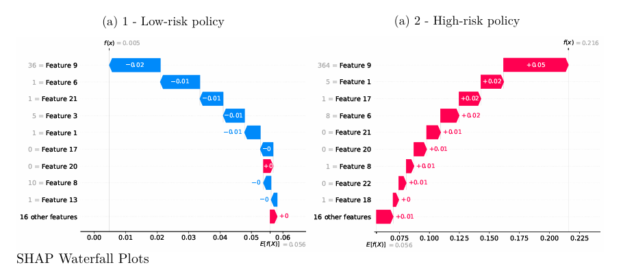
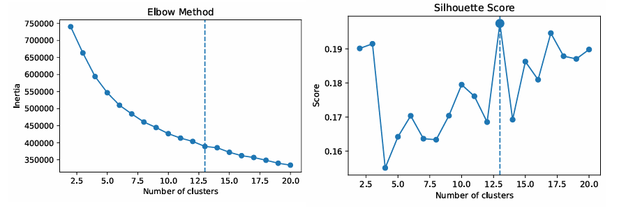

# Motor Insurance Claim Frequency Modeling: Statistical Learning, Deep Learning and Portfolio Segmentation

## Overview

This project focuses on predicting the number of insurance claims (`nombre_de_sinistre`) for a motor fleet insurance portfolio.

The objective is to model claim frequency while accounting for exposure (`Exposition_au_risque`) and compare different statistical and machine learning approaches:

- Generalized Linear Model (Poisson GLM)
- Neural Networks
- Autoencoders / Variational Autoencoders
- K-means clustering
- Model interpretability techniques (PDP, ICE, LIME, SHAP)

The project investigates the trade-off between predictive performance, interpretability, and portfolio segmentation.


---
## Results Preview





---

## Business Context

Claim frequency modeling is a core task in actuarial pricing.
Accurate prediction of claim counts allows insurers to better estimate risk,
segment portfolios, and improve pricing decisions.

The project compares traditional actuarial approaches with modern machine
learning methods.

---

# Project Structure
```text
.
├── code/
│   └── main.py
├── data/
│   └── train_contrats.csv
├── figures/
│   ├── clusters.png
│   ├── PDP_ICE.png
│   └── SHAP.png
├── report/
│   └── claim_frequency_modelling_report.pdf
├── requirements.txt
├── LICENSE
└── README.md
```
---
# Dataset

The dataset used in this project is the French motor insurance dataset from the Freakonometrics repository:

https://freakonometrics.hypotheses.org/48893

Please download the dataset and place it at:

**data/train_contrats.csv**


The dataset contains motor insurance contracts with information about:

- Contract characteristics
- Vehicle characteristics
- Policyholder information
- Exposure duration
- Claim history

The target variable is:
- *nombre_de_sinistre*

representing the number of claims.

The exposure variable:
- *Exposition_au_risque*

is used to properly model claim frequency.

---

# Methodology

## 1. Data preprocessing

Main preprocessing steps:

- Date feature extraction
    - contract start year
    - contract start month
    - contract duration

- Numerical transformations
    - insured value transformation
    - vehicle age conversion

- Feature selection
    - removal of identifiers
    - removal of non-informative variables

- One-hot encoding of categorical variables

- Train/validation split (80/20)

---

# Supervised Learning

## Poisson GLM baseline

A Poisson Generalized Linear Model is used as an actuarial benchmark.

Characteristics:

- Log link function
- Exposure included as an offset
- Highly interpretable model

The GLM provides a strong baseline for comparison.

---

## Neural Networks

Several neural network architectures were tested:

- Single hidden layer network
- Deeper networks
- Dropout regularization
- Higher-capacity models

The best performing model was:

**Neural Network Model 3**

with dropout regularization.

It achieved better predictive performance than the GLM while maintaining reasonable generalization.

---

# Model Interpretability

To understand model predictions, several explainability techniques were applied:

## PDP & ICE

Partial Dependence Plots and Individual Conditional Expectation plots were used to analyze global feature effects.

Main drivers identified:

- Contract duration (`duration_days`)
- Vehicle power (`ValeurPuissance`)
- Management mode (`Mode_gestion_P`)

See:

- [PDP_&_ICE_plots.png](figures/PDP_&_ICE_plots.png)


---

## SHAP & LIME

Local explanations were generated to understand individual policy predictions.

Key finding:

Contract duration is the strongest factor separating low-risk and high-risk policies.

See:

- [SHAP_Waterfall_plots.png](figures/SHAP_Waterfall_plots.png)

---

# Unsupervised Learning

## Autoencoders

Autoencoders and Variational Autoencoders were trained to learn latent representations of insurance contracts.

The analysis showed that standard autoencoders achieved better reconstruction performance.

---

## K-means clustering

K-means was used to identify portfolio segments.

The optimal number of clusters was determined using:

- Elbow method
- Silhouette score

The selected solution:

13 clusters


Clusters revealed heterogeneous groups based on:

- Vehicle characteristics
- Contract type
- Geographic zone
- Policyholder profile

Visualization:

- [Number_of_clusters_identification.png](figures/Number_of_clusters_identification.png)


---

# Results Summary

| Model | Performance |
|------|-------------|
| Neural Network | Best predictive performance |
| GLM | Strong benchmark + high interpretability |

Main conclusions:

- Neural networks captured nonlinear relationships and achieved the best predictive performance among tested models.
- The improvement over the GLM baseline was limited, highlighting the importance of interpretability in insurance applications.
- Portfolio segmentation reveals meaningful risk groups.
- Complexity does not always translate into better insurance pricing models.

---

# Installation

Clone the repository:

```bash
git clone https://github.com/Mateus-Auza/motor-insurance-claim-frequency-modeling.git
cd motor-insurance-claim-frequency-modeling
```
## Running the project

Execute:
```bash
python code/main.py
```
Make sure the dataset is available:

- [train_contrats.csv](data/train_contrats.csv)

## Report

A complete explanation of the methodology, experiments, and results is available here:

- [claim_frequency_modelling_report.pdf](report/DL_claim_frequency_modelling_report.pdf)

## Author

Mateus Auza Cruz

Motor Insurance Claim Frequency Modeling Project
2026

